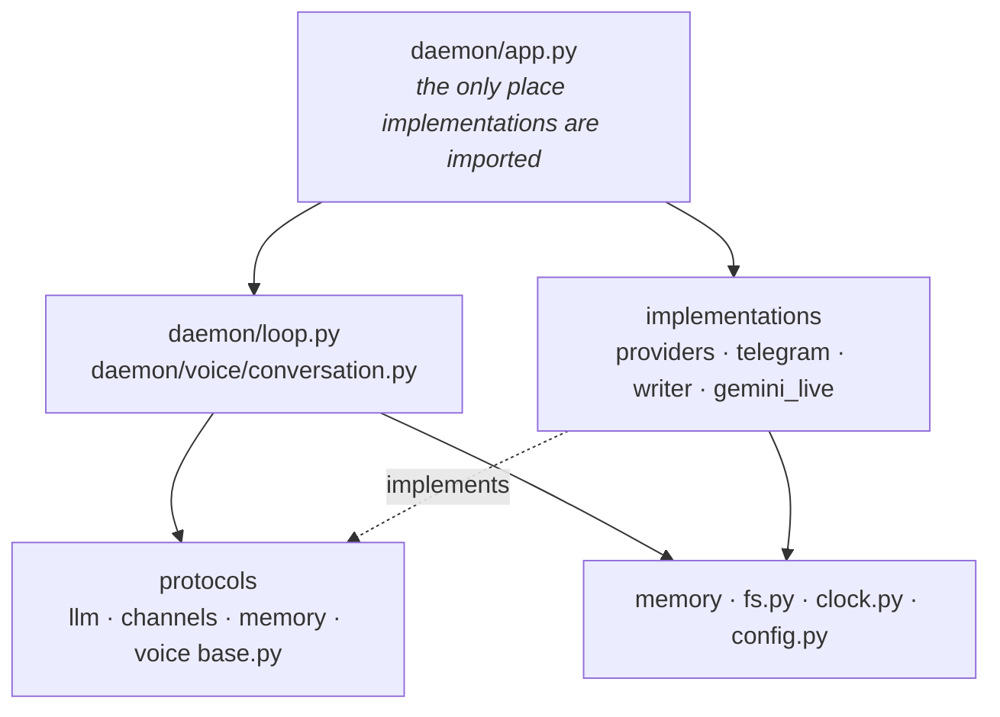

# Daemon — orientation

A self-hosted AI companion: one resident process, markdown as the source of
truth, a personality that evolves, and a loop that decides when to speak first.

**Read [docs/CONTRACTS.md](docs/CONTRACTS.md) before writing code** — short, and
binding, because breaking one of its rules loses user data, leaks a secret, or
launders untrusted text into the personality. Rationale:
[docs/PLAN.md](docs/PLAN.md) (Korean). Decisions, and the measurements that
overturned some of them: [docs/adr/](docs/adr/). Layout:
[docs/ARCHITECTURE.md](docs/ARCHITECTURE.md).

## Where things are

| | |
|---|---|
| [daemon/](daemon/CLAUDE.md) | the process: entrypoint, config, channels, memory, llm, voice |
| [tests/](tests/CLAUDE.md) | 700+ tests, plus reachability and acceptance gates |
| [evals/](evals/CLAUDE.md) | recall golden set, and the live-API voice spike |
| `docs/` | PLAN (design), CONTRACTS (rules), ARCHITECTURE (layout), adr/ (decisions) |
| [scripts/](scripts/CLAUDE.md) | repo checks that run in CI and import no product code |

## Which way imports are allowed to point



There is no arrow from `CORE` to `IMPL`, and that absence is the rule. `tests/`
depends on all of it; `scripts/` depends on none of it. Runtime data flow — a
different question — is in
[docs/ARCHITECTURE.md](docs/ARCHITECTURE.md).

## Commands

```bash
python3 -m pytest                  # the whole suite
python3 -m ruff check .            # lint
python3 scripts/check_docs.py      # documented paths exist
python3 -m evals.golden_set --json # recall quality, and log the run's conditions
daemon setup                       # onboarding; daemon doctor to inspect
```

## Common changes

Per-module recipes are in the module's own file — a provider or channel in
[daemon/](daemon/CLAUDE.md), a golden case in [evals/](evals/CLAUDE.md), a gate in
[tests/](tests/CLAUDE.md). Two that span the repo:

**Starting a milestone.** Its gate is in `docs/PLAN.md` §8.2 and is written as a
thing you can do, not a thing you can build. Close the matching `PENDING_TASKS` /
`PENDING_CLASSES` entries in `tests/test_reachable.py` as you wire each piece up.

**Changing a frozen contract** — `daemon/tasks.py`, `daemon/memory/schema.sql`, or
a protocol file. Allowed; doing it quietly is not. Say so, and check
[docs/adr/](docs/adr/) first: four of these were corrected by measurement, so the
shape you are about to simplify may be the shape reality insisted on.

## Measured outcomes, not impressions

`evals/agent-results.json` is the last golden-set run as data — the pass rate
*and* the embedder, the backfill limit, and how many vectors existed when it was
taken. **Why:** a bare "93.3%" was once quoted from a run whose backfill limit was
20× production's, and nothing in the number said so.

## Non-obvious things that will bite you

- **Markdown is written before the sqlite mirror, and it is fsynced.** Reverse
  either and a power cut leaves a row whose record does not exist. The mirror is
  rebuildable (`daemon reindex`); the markdown is not.
- **Recall Lane 1 makes no LLM call.** It is on the voice latency path. An
  embedder call is fine and costs ~117 ms, almost all fixed overhead.
- **`data/persona/seed.md` is human-owned. Code must never write to it.** That
  asymmetry is the anchor that keeps an evolving personality from collapsing into
  agreement.
- **Nothing under `daemon/` may import a provider or a channel implementation.**
  `daemon/app.py` is the single exception, and its imports are function-local so
  the exception stays visible.
- **A silent degradation is the dangerous failure here, not an exception.** Recall
  dropping to keyword-only, a dead conversation loop, an unfinished backfill —
  each looked healthy while the product was broken. Report state, do not assume it.

## Before you say it works

`pytest` passing is not the same as it working; that gap is where every defect
this project has shipped actually lived. Run the thing. And if you build a
component, make sure something constructs it — `tests/test_reachable.py` exists
because that failed three times.
