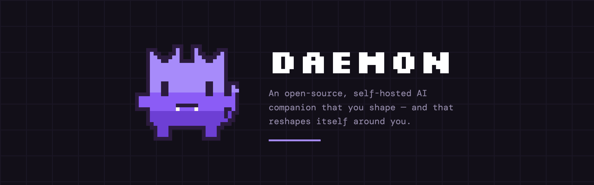
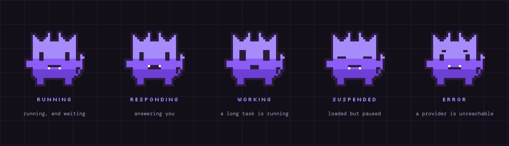

<div align="center">

<h1></h1>

<p>
  <a href="https://github.com/K2D2H4/Daemon/actions/workflows/ci.yml"></a>
  
  
  
</p>

**[k2d2h4.github.io/Daemon](https://k2d2h4.github.io/Daemon/)** &nbsp;·&nbsp;
[Design notes](docs/PLAN.md) &nbsp;·&nbsp;
[Architecture](docs/ARCHITECTURE.md) &nbsp;·&nbsp;
[Contracts](docs/CONTRACTS.md) &nbsp;·&nbsp;
[Decisions](docs/adr/)

</div>

---

A process that lives on your machine. Two things about it are not available
anywhere else, open or closed:

**Its personality evolves.** You write the seed — name, temperament, how it
talks. From then on it watches how you actually respond and accumulates rules
about dealing with *you specifically*. Those rules feed back into who it is.
Every other companion has a personality file a human edits.

**It speaks first, on its own judgement.** Not a reminder you scheduled, and not
a canned line when you open the app. A background loop asks whether there is a
reason to say something now, whether now is a bad moment, and whether it has
already talked too much today — and stays silent unless all three line up.

Everything else — the memory graph, the reflection pass, recall scoring — is table
stakes we borrow rather than claim. Design notes, including what we took from whom
and why: **[docs/PLAN.md](docs/PLAN.md)** (Korean). Architecture:
**[docs/ARCHITECTURE.md](docs/ARCHITECTURE.md)**. Decisions and the measurements
that overturned some of them: **[docs/adr/](docs/adr/)**.

## Try it

```bash
git clone https://github.com/K2D2H4/Daemon.git && cd Daemon
pip install -e ".[dev]"     # Python 3.13
daemon setup
```

`daemon setup` asks where the thinking should happen, whose model, and a Telegram
bot token from [@BotFather](https://t.me/BotFather). Then it waits for you to
message the bot and asks whether that was you — nobody types a numeric user id.
Pick `offline` and you need no API key at all, just [Ollama](https://ollama.com).

```bash
daemon run       # here, in this terminal
daemon install   # or keep it running after you close it, and after a reboot
daemon voice     # one spoken conversation
daemon wake calibrate  # what your on-device recognizer actually hears you say
daemon wake test       # run the always-on wake gate here, and see what fires
daemon reflect   # consolidate a day into memory now, instead of waiting for 04:00
daemon proactive # one round of "is there a reason to speak?", and what it decided
daemon doctor    # what is configured, reachable, indexed and remembered
```

## What it is doing, at a glance

<div align="center">

</div>

The expression is picked from the state rather than the other way round. Two of
them animate; the other three sit still, which is itself the information.

## Deciding whether to speak

The proactive loop runs every five minutes and mostly decides to say nothing. The
gate is deterministic — same inputs, same verdict — so `daemon proactive` runs one
round and prints what the resident process would have done. Without `--speak` it
is assembled with no judge and no delivery, so it cannot speak even if the gate
opens, and it costs no model call:

```console
$ daemon proactive
presence: idle 0s · app Claude · audio free

proactivity is off (DAEMON_PROACTIVE_ENABLED=true to turn it on).
Nothing was generated, so switching it on later starts from today.
```

That is the default, on a fresh install. Switch it on and each due candidate is
printed with the rule that allowed or blocked it, plus a `blocked by:` tally.

Every rule is a setting, and these are the shipped defaults:

| | | |
|---|---|---|
| `DAEMON_PROACTIVE_ENABLED` | `false` | it says nothing until you turn this on |
| `DAEMON_PROACTIVE_SPEAKER_ENABLED` | `false` | the speaker is a second, separate switch |
| `DAEMON_PROACTIVE_QUIET_HOURS` | `23:00-09:00` | local time, never interrupted |
| `DAEMON_PROACTIVE_COOLDOWN_MINUTES` | `90` | minimum gap between two things it says |
| `DAEMON_PROACTIVE_DAILY_BUDGET` | `3` | most it will ever say in one day |
| `DAEMON_PROACTIVE_OPEN_LOOP_BUDGET` | `1` | of those three, at most one unfinished-thread nudge |

Past the gate there is exactly one model call, which decides whether there is
anything worth saying at all — and usually there is not. The
**[landing page](https://k2d2h4.github.io/Daemon/)** walks through a day of those
verdicts.

## How it is put together

- **One process.** `uvicorn` plus an in-process scheduler — no Celery, no Redis,
  no Postgres, because there is one user. It installs as a LaunchAgent or systemd
  user unit, since something that speaks first must outlive your terminal.
- **Markdown is the source of truth.** Conversations, entity notes and the
  personality are plain wiki-linked files under `data/`, openable in Obsidian or
  `cat`. SQLite is a rebuildable index — delete it and run `daemon reindex`.
- **File ownership is split, deliberately.** The seed persona is yours and the
  code never writes to it; what it learns about you is its own file. That
  asymmetry is what stops an evolving personality from drifting into whatever
  agrees with you most.

Full layout, the write order and the measured latency budget:
**[docs/ARCHITECTURE.md](docs/ARCHITECTURE.md)**.

## Your data, and where it goes

The honest version, because it is more useful than a slogan:

- Memory and personality are **files on your machine**. Nothing is synced.
- **Text mode with a local model is fully offline.** The `offline` preset routes
  every task to Ollama and has no voice route at all, which is what makes that
  sentence true rather than aspirational.
- **Voice sends audio to the provider you chose**, with your own key. Turn voice
  off and it does not. Proactive speech at your desk uses your local speaker and
  touches no network.
- **Telegram means your messages cross Telegram's servers.** It is the first
  channel because it is the only one that reaches your phone for free.
- Hosted models are **bring-your-own-key** throughout, with a hard spend limit.

## Status

Early. Public because the design decisions are worth arguing with, not because it
is finished.

| | |
|---|---|
| **M1a** ✅ | Text conversation over Telegram, logged to markdown |
| **M1b** ✅ | Recall, voice, OS residency |
| **M2** ✅ | Reflection pass, entity graph, observations, and recall reads the curated tier |
| **M3** ◐ | Proactivity — it speaks first, on a five-minute loop that mostly decides not to. Off until you switch it on; the speaker is a second switch. Tuning waits on labels |
| M4 | Persona evolution |

Recall scores **93.3% on the golden set** — 28 of 30, top-5, `bge-m3`, with every
embedding indexed. Those conditions are part of the number: the same suite reads
50.0% keyword-only, and 83.3% on a smaller embedder. `evals/agent-results.json`
holds the last run as data, and `python3 -m evals.golden_set --json` reproduces it.

## Contributing

Read **[docs/CONTRACTS.md](docs/CONTRACTS.md)** first — short, and binding. Its
non-negotiables are not style preferences; each exists because breaking one loses
user data, leaks a secret, or launders untrusted text into the personality.

```bash
python3 -m pytest                        # the whole suite
python3 -m ruff check .                  # lint
python3 scripts/check_docs.py            # every documented path exists
python3 scripts/check_landing_claims.py  # the landing page still matches the code
```

All four pass, or the change is not done — and tests never touch the network.

## License

MIT.
