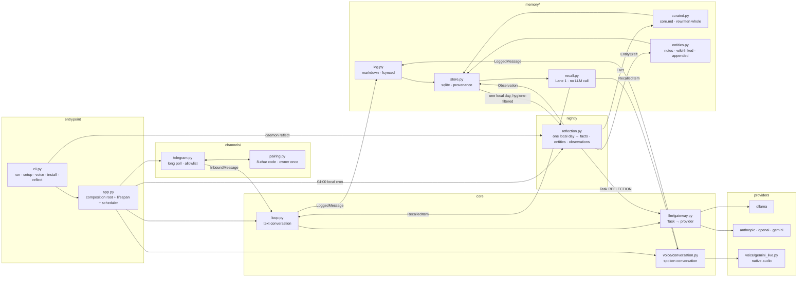

# Architecture

One process. Markdown is the source of truth, SQLite is a rebuildable index, and
every seam is a protocol so the implementations stay swappable. Design rationale
is in [PLAN.md](PLAN.md); the rules that follow from it are in
[CONTRACTS.md](CONTRACTS.md).

## The shape

Both arrows into `daemon/reflection.py` are the same object: `daemon reflect` and the
04:00 job are assembled by one function, `app.build_reflection`, because a job
nobody can run by hand is a job nobody can verify.

## The nightly pass

`daemon/reflection.py` runs at **04:00 local time** — not UTC, because "overnight" is a
fact about the person asleep next to the machine, and a UTC 04:00 lands
mid-afternoon in KST. Late enough that the day is over, early enough that the
morning's first message already sees what it concluded. The job coalesces and
allows one instance, so a machine that was asleep at 04:00 reflects once when it
wakes rather than queueing a night per missed day; `Reflection.catch_up` covers
the backlog anyway, oldest first, and skips today because today is still being
written to.

**What it reads** is one local day of `messages`, selected by `log_file` rather
than a range over `ts` — the log is split on the *local* day while timestamps are
UTC, so a `BETWEEN` on `ts` would silently reflect on a nine-hour-shifted window.
Two hygiene rules filter it (PLAN.md 4.2): rows from `proactive` and `reflection`
sessions are excluded, because letting the daemon's own speech become evidence is
a self-amplifying loop; and rows recall already put in front of the model are
excluded, because context injected once must not be counted again as new
evidence.

**What it writes** is three things, plus the artifact a human reads to check them:

| | markdown | mirror |
|---|---|---|
| curated facts, always injected | `data/memory/core.md` | `memory_entries` |
| entity notes, searched and wiki-linked | `data/memory/entities/` | `entities` · `entity_links` |
| observations, M4's evidence | in the artifact only | `observations`, append-only |
| the artifact | `data/memory/reflections/` | — |

The artifact is written first and is also the idempotence marker: if the file for
a day exists, the day is done. It is a file rather than a column because
`daemon/memory/schema.sql` is frozen, and because "this day has been reflected on" is
markdown-side state under non-negotiable 1 anyway.

Everything the model produced is treated as hostile input on the way in — names
are checked twice before becoming filenames (a blocklist, then a boundary on the
resolved path), `importance` and `confidence` are clamped rather than rejected,
supersession keys are narrowed to `[a-z0-9_]`, and a reply with no parseable JSON
writes nothing at all. A half-applied reflection is worse than a skipped one,
because the day gets marked done either way.

## Write order, and why it is not negotiable

`MemoryWriter.record` writes the **markdown first, then the sqlite mirror**, and
the markdown append is fsynced. Reverse either and a power cut leaves a row in
sqlite whose record does not exist in the file that is supposed to be the original.
The mirror can be rebuilt (`daemon reindex`); the markdown cannot.

What a rebuild cannot recover is provenance — `origin`, `session_kind`, `modality`
— because the markdown deliberately does not carry it, so a model cannot forge it
in prose. Rebuilt rows are flagged `reindexed = 1` so reflection can tell an
inference from an observation.

### `data/memory/core.md` takes three steps, not two

The usual order is markdown, then mirror. The curated tier needs one more step,
because that file is not appended to — it is a **rewrite of the whole active
set**, and only the mirror knows what a new fact *retires*. So `CuratedMemory.add`
does:

1. run the retire-and-insert **without committing**. The connection now sees its
   own uncommitted rows, so the file can be rendered from the post-insert
   ordering instead of that ordering being reimplemented in the renderer and
   drifting from the query.
2. write and fsync the markdown, atomically, via `fs.write_private_replace`.
3. commit the mirror.

Read it by where each failure lands. A failure at 2 rolls step 1 back, so neither
side moved. A failure at 3 leaves the fact in the markdown and not in the mirror
— which is the recoverable direction, because `curated.rebuild` puts it back on
the next `daemon reindex`. The reverse order fails the other way: a committed row
whose sentence never reached the file is a fact that exists only in the
rebuildable index, and no rebuild can invent it.

That is also why `daemon reindex` now restores all three tiers rather than just
messages. A rebuild that only replayed the log would drop every curated fact and
every entity note — the exact loss non-negotiable 1 exists to make impossible.
What it cannot restore is provenance: rebuilt facts come back with default
importance, no supersession key, and `origin='system'`, which is deliberately
visible so reflection can tell its own conclusion from a rebuild's guess.

## The seams

| protocol | in | implementations |
|---|---|---|
| `Provider` | `daemon/llm/base.py` | ollama · anthropic · openai · gemini |
| `Embedder` | `daemon/llm/base.py` | ollama (`bge-m3`) |
| `Channel` | `daemon/channels/base.py` | telegram |
| `Cursor` | `daemon/channels/base.py` | `memory.store.Store` |
| `MemoryWriter` · `Recall` | `daemon/memory/base.py` | `FileMemoryWriter` · `MemoryRecall` |
| `VoiceSession` · `AudioIO` | `daemon/voice/base.py` | `GeminiLiveSession` · `SoundDeviceAudio` |
| `Reflection`'s collaborators | `daemon/reflection.py` | `CuratedMemory` (`daemon/memory/curated.py`) · `EntityNotes` (`daemon/memory/entities.py`) |

The last row is not a protocol, and deliberately so: there is one writer per tier
and a second would be speculation. It is a seam because `Reflection` takes both
writers and an `LLMGateway` as constructor arguments, which is what lets a test
drive the pass without a filesystem and lets `app.build_reflection` be the single
place they are assembled for both the CLI and the scheduler.

Nothing outside `daemon/app.py` imports an implementation. `tests/test_reachable.py`
enforces the other half of that bargain: every implementation must be constructed
by something, or declared pending with the milestone that owns it.

## Routing

Two axes, deliberately not multiplied together. A **preset** answers *where work
runs* (`offline` · `balanced` · `quality`); `DAEMON_HOSTED_PROVIDER` answers *whose
model*. Per-task overrides win over both. `Task.EMBED` stays local in every
preset because it runs on every message and every query;
`Task.PROACTIVE_JUDGE` stays local because it runs every five minutes whether or
not it ever speaks.

`Task.CHAT_VOICE` is pinned to Gemini: in native audio the model *is* both the
brain and the voice, so it cannot be pointed at a provider without a voice
session.

## Latency budget (measured)

| | |
|---|---|
| recall Lane 1, total | ~121 ms — of which the embedder is ~117 ms |
| FTS5 lane / vector lane at 10k | 1.9 ms / 0.22 ms |
| voice: setup → first audio | 0.56 s → 740 ms |
| local chat, gemma3:4b | 1.7 s |

The embedder dominates and is mostly fixed overhead, so a smaller model does not
help. Voice hides it instead: recall starts from the *partial* transcript, while
the user is still speaking.

## Residency

`daemon install` writes a LaunchAgent or a systemd user unit. It carries no
secrets — the unit points at a working directory and the process reads `.env` from
there, because `launchctl print` echoes plists back and `~/Library` is backed up.
Residency is a precondition for M3: something that speaks first has to outlive the
terminal and the reboot.
