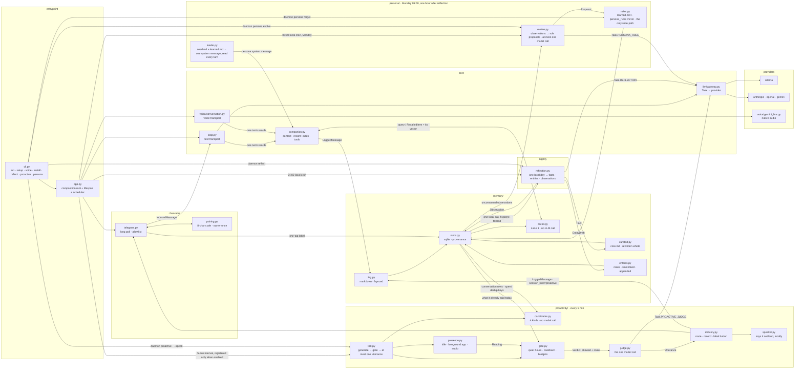

# Architecture

One process. Markdown is the source of truth, SQLite is a rebuildable index, and
every seam is a protocol so the implementations stay swappable. Design rationale
is in [PLAN.md](PLAN.md); the rules that follow from it are in
[CONTRACTS.md](CONTRACTS.md).

## The shape

The two conversation endpoints are transports, and everything they both need is
`daemon/companion.py`: the persona, the tool rules, the recall block with its
injection boundary, and one message written to markdown, mirrored, and embedded.
They are not one pipeline, and that is deliberate — text assembles a fresh prompt
per request while voice is a stream whose history the server holds and where a
message sent mid-generation kills the answer. Sharing the capability is free;
sharing a turn shape would hide that. The layer exists because it had already been
paid for: nothing embedded a *voice* turn, so what was said out loud stayed out of
the vector lane until the next restart.

Both arrows into `daemon/reflection.py` are the same object: `daemon reflect` and the
04:00 job are assembled by one function, `app.build_reflection`, because a job
nobody can run by hand is a job nobody can verify. The two into
`daemon/proactivity/tick.py` work the same way, through `app.build_proactive_tick` —
and there the CLI's default assembles *less*: no gateway, no channel, no speaker, so
`daemon proactive` cannot speak even by mistake. So do the two into
`daemon/persona/evolve.py`, through `app.build_persona_evolution`: the Monday job and
`daemon persona evolve` run the identical `PersonaEvolution`.

## Screen data flow

Two paths, both behind `DAEMON_SCREEN_ENABLED` (needing `DAEMON_TOOLS_ENABLED` too) and
both macOS-only. On demand, `see_screen` (`daemon/tools/screen.py`) shells out to
`screencapture`+`sips` — no new dependency — and returns `ToolOutput(content, images)`;
`daemon/tools/runner.py` carries `images` onto `ToolResult`, and `daemon/loop.py` attaches
them as a fresh `user` turn framed by `screen_note` rather than inside the `tool`-role
message, because a `user` turn holding an image is the one shape all four providers
accept (ADR 0009). Live and voice-only, `start_screen_share`/`stop_screen_share` toggle a
`ScreenSharePump` (`daemon/voice/screen_share.py`, the one file in this stack that imports
Pillow) that captures at `screen_fps` (default 1), dhashes each frame against the last one
*sent*, and forwards a frame to `VoiceSession.send_frame` only on real change or an elapsed
keepalive. Those two tools exist only because `app._build_tools` takes a keyword-only
`screen_share` param that only `run_voice` passes — the text registry passes none, so it
never offers them. Starting a share always speaks an acknowledgement (the explicit-signal
rule); a frame actually landing on Gemini Live's socket is implemented, not yet confirmed
against a live connection.

## The nightly pass

`daemon/reflection.py` runs at **04:00 local time** — not UTC, because "overnight" is a
fact about the person asleep next to the machine, and a UTC 04:00 lands
mid-afternoon in KST. Late enough that the day is over, early enough that the
morning's first message already sees what it concluded. The job coalesces and
allows one instance, so a machine that was asleep at 04:00 reflects once when it
wakes rather than queueing a night per missed day; `Reflection.catch_up` covers
the backlog anyway, oldest first, and skips today because today is still being
written to.

**What it reads** is one local day of `messages`, selected by `log_file` rather
than a range over `ts` — the log is split on the *local* day while timestamps are
UTC, so a `BETWEEN` on `ts` would silently reflect on a nine-hour-shifted window.
Two hygiene rules filter it (PLAN.md 4.2): rows from `proactive` and `reflection`
sessions are excluded, because letting the daemon's own speech become evidence is
a self-amplifying loop; and rows recall already put in front of the model are
excluded, because context injected once must not be counted again as new
evidence.

**What it writes** is three things, plus the artifact a human reads to check them:

| | markdown | mirror |
|---|---|---|
| curated facts, always injected | `data/memory/core.md` | `memory_entries` |
| entity notes, searched and wiki-linked | `data/memory/entities/` | `entities` · `entity_links` |
| observations, M4's evidence | in the artifact only | `observations`, append-only |
| the artifact | `data/memory/reflections/` | — |

The artifact is written first and is also the idempotence marker: if the file for
a day exists, the day is done. It is a file rather than a column because
`daemon/memory/schema.sql` is frozen, and because "this day has been reflected on" is
markdown-side state under non-negotiable 1 anyway.

Everything the model produced is treated as hostile input on the way in — names
are checked twice before becoming filenames (a blocklist, then a boundary on the
resolved path), `importance` and `confidence` are clamped rather than rejected,
supersession keys are narrowed to `[a-z0-9_]`, and a reply with no parseable JSON
writes nothing at all. A half-applied reflection is worse than a skipped one,
because the day gets marked done either way.

## The weekly persona pass

`daemon/persona/evolve.py` runs at **05:00 local time on Monday** — one hour after
reflection, so a week's `observations` have already had the last night's reflection
land before evolution reads them. Registered the same way as reflection:
`max_instances=1`, `coalesce=True`, no misfire grace, so a laptop asleep at 05:00
Monday evolves once when it wakes rather than queuing a run per missed week.

Three gates run **before any model call**, in order, and `daemon doctor` checks
each of them the same way `PersonaEvolution.run` does:

1. this week's diary already exists (`data/persona/diary/YYYY-MM-DD.md`, dated by
   the Monday of the local week `now` falls in, not the day the pass happens to
   execute — so a scheduled Monday run and an hour-run `daemon persona evolve` on
   a Wednesday agree on which week's marker they are reading);
2. fewer than `persona_min_observations` (default 5) unconsumed observations exist
   — a handful must not be enough to conclude a pattern;
3. the active-rule budget (`persona_max_active_rules`, default 20) is already full.

Only past all three is `Task.PERSONA_RULE` called, with the identity anchor
(`seed.md`), the currently active rules, and up to `OBSERVATION_BUDGET` (60,
a ceiling on the prompt, separate from the gate-2 minimum) unconsumed
observations. The reply is treated as hostile the same way reflection's is:
bodies are clamped to `MAX_BODY_CHARS`, supersession keys are narrowed to
`[a-z0-9_]`, and any evidence id that was not actually in the unconsumed set
handed to the prompt is dropped. Proposals past `persona_max_new_per_cycle`
(default 3) for this cycle are **reported, not silently discarded** — the diary
records how many were dropped and why, the same asymmetry PLAN.md 6's proactivity
budgets and reflection's clamps both take.

**Write order is markdown, then mirror, then observation consumption** —
non-negotiable 1, same direction as every other writer. Unlike
`data/memory/core.md`, `data/persona/learned.md` has no unique index to make a
single insert atomic with its own retire, so `LearnedRules.add` computes the
whole batch's file content in Python first (current active bodies, minus
whatever this batch supersedes, plus the new ones), writes it durably via
`fs.write_private_replace`, and only then
retires the superseded mirror rows, inserts the new ones, and marks their
evidence `consumed_by`. A crash before the mirror write leaves a markdown file
ahead of the mirror — recoverable, because the diary marker was not written
either, so the pass simply reruns. A crash after would leave a mirror row with
nothing in the file, which non-negotiable 1 forbids.

Two proposals sharing a `supersession_key` in the same batch are resolved
**before either is written** — keeping the first, reporting the second as
discarded. This is the same defect PLAN.md 8.2.1 recorded for the curated tier
(two facts both keyed `location`, applied in order, the important half lost),
guarded against here before it can happen rather than after.

`daemon persona forget <id> --why "..."` is the one human-initiated write: it
rewrites `learned.md` without that rule's body and retires its mirror row, but
never touches `consumed_by` on the observations the rule was built from —
non-negotiable 6 makes `observations` append-only, and reverting it would let
next week's pass revive the same rule from the same evidence.

`daemon/proactivity/judge.py` deliberately does not go through
`daemon/persona/loader.py`: it reads `seed.md` alone, because its prompt is kept
intentionally minimal and widening it to learned rules is a separate decision
this milestone does not make.

## Proactivity: three stages, and exactly one model call

Every five minutes, and only when `DAEMON_PROACTIVE_ENABLED` is on — the job is not
registered otherwise, because an absent job says "off" more clearly than a disabled
one that still fires. The stages are separate objects on purpose (PLAN.md 6.1, and
non-negotiable 7):

| stage | file | model calls |
|---|---|---|
| reasons it might be worth speaking | `daemon/proactivity/candidates.py` | 0 |
| whether now is a safe moment, and where it may go | `daemon/proactivity/gate.py` | 0 |
| what to say — or nothing | `daemon/proactivity/judge.py` | **1**, after the gate |
| getting it there and writing it down | `daemon/proactivity/delivery.py` | 0 |

The order is the argument. Asked "should I speak?" as an open question a model says
yes almost every time — measured, PLAN.md 6.2.1 — so it is never asked that. Timing,
frequency and presence are settled by arithmetic first, and the model gets the one
question it can answer: given this reason, in this voice, is there a sentence.
Declining is a first-class answer and the common one.

**Presence is a reading, not a verdict, and it is three-valued.**
`daemon/proactivity/presence.py` reports what each probe measured — idle seconds,
foreground app, whether the audio device is running — and `None` when a probe could
not answer, with the reason. `None` is neither "here" nor "away". The gate owns the
thresholds and stores the whole reading in `proactive_utterances.gate_snapshot`, so a
bad call is readable afterwards instead of reconstructed.

**Blocking and routing are different decisions**, and PLAN.md 6.4's asymmetry is why:
an ignored Telegram message costs nothing, a voice out of the laptop during a meeting
is an accident. So quiet hours, the cooldown and the budgets block the utterance,
while everything that bears only on interruption — an unreadable probe, a meeting app
in front, an audio device in use — costs the *speaker* and sends the same words to
Telegram. Two switches, both defaulting off and gated separately, because those two
failure costs are not comparable:

| | |
|---|---|
| `DAEMON_PROACTIVE_ENABLED` | speak first at all |
| `DAEMON_PROACTIVE_SPEAKER_ENABLED` | and out of this machine's speaker |

There are also **two cooldowns**, which are not the same brake:
`proactive_candidates.cooldown_secs` is per-candidate ("do not raise *this* reason
again"), and `DAEMON_PROACTIVE_COOLDOWN_MINUTES` is the global gap between any two
utterances. Collapsing them would let five different candidates fire in five minutes,
each honouring its own.

**One utterance per tick**, and the loop stops there: the gate counts the day's budget
from rows already stored, so a second delivery in the same tick would read the same
pre-tick count and overshoot it. Anything still due is reconsidered five minutes later.

`daemon proactive` runs one round and prints the reading, every due candidate and
which rule allowed or blocked it, without calling a model. `--speak` lets it decide
and deliver. `daemon doctor` reports whether it is on, the budgets, and the label
tally with precision — plus a **blocker** if `data/persona/seed.md` is missing, because
the judge declines every candidate without one and proactivity would otherwise look
switched on and never say a word.

## Write order, and why it is not negotiable

`MemoryWriter.record` writes the **markdown first, then the sqlite mirror**, and
the markdown append is fsynced. Reverse either and a power cut leaves a row in
sqlite whose record does not exist in the file that is supposed to be the original.
The mirror can be rebuilt (`daemon reindex`); the markdown cannot.

What a rebuild cannot recover is provenance — `origin`, `session_kind`, `modality`
— because the markdown deliberately does not carry it, so a model cannot forge it
in prose. Rebuilt rows are flagged `reindexed = 1` so reflection can tell an
inference from an observation.

### `data/memory/core.md` takes three steps, not two

The usual order is markdown, then mirror. The curated tier needs one more step,
because that file is not appended to — it is a **rewrite of the whole active
set**, and only the mirror knows what a new fact *retires*. So `CuratedMemory.add`
does:

1. run the retire-and-insert **without committing**. The connection now sees its
   own uncommitted rows, so the file can be rendered from the post-insert
   ordering instead of that ordering being reimplemented in the renderer and
   drifting from the query.
2. write and fsync the markdown, atomically, via `fs.write_private_replace`.
3. commit the mirror.

Read it by where each failure lands. A failure at 2 rolls step 1 back, so neither
side moved. A failure at 3 leaves the fact in the markdown and not in the mirror
— which is the recoverable direction, because `curated.rebuild` puts it back on
the next `daemon reindex`. The reverse order fails the other way: a committed row
whose sentence never reached the file is a fact that exists only in the
rebuildable index, and no rebuild can invent it.

That is also why `daemon reindex` now restores all three tiers rather than just
messages. A rebuild that only replayed the log would drop every curated fact and
every entity note — the exact loss non-negotiable 1 exists to make impossible.
What it cannot restore is provenance: rebuilt facts come back with default
importance, no supersession key, and `origin='system'`, which is deliberately
visible so reflection can tell its own conclusion from a rebuild's guess.

### A proactive utterance inverts it, for the label button

`daemon/proactivity/delivery.py` writes the **sqlite row first**, then sends, then
logs the markdown. The `utterance_id` has to be on the 👍/👎 button before the message
leaves, or a fast tap resolves to nothing and the user is told their label was stale.
Non-negotiable 1 is about never losing *user data*; this row is our own bookkeeping
and `daemon reindex` can rebuild it from the markdown that follows.

If nothing reached the user the row is **deleted** and the candidate stays live and
un-fired. An utterance that reached nobody was not said: keeping it would spend the
day's budget on silence and put an unlabelable message into the precision numbers M3
is judged on. That delete is deliberate, and it is the one destructive write to
`proactive_utterances` — non-negotiable 6 makes `observations` append-only and says
nothing about this table.

The utterance is logged with `session_kind='proactive'`, which is what the hygiene
rules filter on. The daemon's own speech must not become evidence for the next
reflection, nor reset the silence clock that decides whether to speak again —
otherwise speaking is its own excuse to speak.

## The seams

| protocol | in | implementations |
|---|---|---|
| `Provider` | `daemon/llm/base.py` | ollama · anthropic · openai · gemini |
| `Embedder` | `daemon/llm/base.py` | ollama (`bge-m3`) |
| `Channel` | `daemon/channels/base.py` | telegram |
| `Cursor` | `daemon/channels/base.py` | `memory.store.Store` |
| `MemoryWriter` · `Recall` | `daemon/memory/base.py` | `FileMemoryWriter` · `MemoryRecall` |
| `VoiceSession` · `AudioIO` | `daemon/voice/base.py` | `GeminiLiveSession` · `SoundDeviceAudio` |
| `Presence` | `daemon/proactivity/base.py` | `MachinePresence` — macOS probes, unknown elsewhere |
| `Judgement` · `Speaker` | `daemon/proactivity/base.py` | `Judge` · a local speaker |
| `Reflection`'s collaborators | `daemon/reflection.py` | `CuratedMemory` (`daemon/memory/curated.py`) · `EntityNotes` (`daemon/memory/entities.py`) |
| `PersonaEvolution`'s collaborator | `daemon/persona/evolve.py` | `LearnedRules` (`daemon/persona/rules.py`) |

`Speaker` is deliberately not a special case of `VoiceSession`. The Live API has no
verbatim TTS path — `realtimeInput.text` is a prompt, so the model answers the text
instead of reading it — which makes saying a sentence we already chose a local job,
and one where nothing leaves the machine.

The last two rows are not protocols, and deliberately so: there is one writer per
tier (or per rule set) and a second would be speculation. Each is a seam because
`Reflection` and `PersonaEvolution` take their collaborators and an `LLMGateway`
as constructor arguments, which is what lets a test drive either pass without a
filesystem and lets `app.build_reflection` / `app.build_persona_evolution` be the
single place each is assembled for both the CLI and the scheduler.

Nothing outside `daemon/app.py` imports an implementation. `tests/test_reachable.py`
enforces the other half of that bargain: every implementation must be constructed
by something, or declared pending with the milestone that owns it.

## Routing

Two axes, deliberately not multiplied together. A **preset** answers *where work
runs* (`offline` · `balanced` · `quality`); `DAEMON_HOSTED_PROVIDER` answers *whose
model*. Per-task overrides win over both. `Task.EMBED` stays local in every
preset because it runs on every message and every query;
`Task.PROACTIVE_JUDGE` stays local everywhere except `quality`, because it belongs to
a loop that wakes 288 times a day and whose correct answer is usually silence — under
`quality` that trade is made the other way on purpose, and a 4B model's habit of
answering a contentless reason with an empty pleasantry (PLAN.md 6.2.1) is the reason
somebody would.

`Task.CHAT_VOICE` is pinned to Gemini: in native audio the model *is* both the
brain and the voice, so it cannot be pointed at a provider without a voice
session.

`Task.PERSONA_RULE` follows `Task.REFLECTION`'s routing in every preset: both
write conclusions that propagate into everything downstream of them — the
curated tier and entity graph for one, the whole personality for the other —
so both get the same preference for a hosted model.

## Latency budget (measured)

| | |
|---|---|
| recall Lane 1, total | ~121 ms — of which the embedder is ~117 ms |
| FTS5 lane / vector lane at 10k | 1.9 ms / 0.22 ms |
| voice: setup → first audio | 0.56 s → 740 ms |
| local chat, gemma3:4b | 1.7 s |
| one presence reading, all three probes | ~20 ms — ~200 ms when `osascript` is the fallback |

A presence reading is on a five-minute tick and on nothing else; the three probes cost
11–16 ms (`ioreg`), 7.7 ms (`lsappinfo`, median) and 0.1 ms warm (CoreAudio, 77 ms on
the first call in a process). None of it is on the voice latency path.

The embedder dominates recall and is mostly fixed overhead, so a smaller model does not
help. Voice hides it instead: recall starts from the *partial* transcript, while
the user is still speaking.

## Residency

`daemon install` writes a LaunchAgent or a systemd user unit. It carries no
secrets — the unit points at a working directory and the process reads `.env` from
there, because `launchctl print` echoes plists back and `~/Library` is backed up.
Residency is a precondition for M3: something that speaks first has to outlive the
terminal and the reboot.
