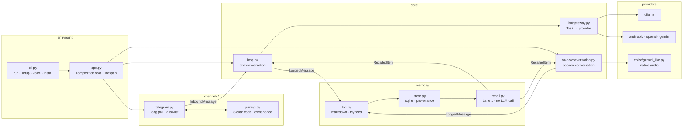

# Architecture

One process. Markdown is the source of truth, SQLite is a rebuildable index, and
every seam is a protocol so the implementations stay swappable. Design rationale
is in [PLAN.md](PLAN.md); the rules that follow from it are in
[CONTRACTS.md](CONTRACTS.md).

## The shape

## Write order, and why it is not negotiable

`MemoryWriter.record` writes the **markdown first, then the sqlite mirror**, and
the markdown append is fsynced. Reverse either and a power cut leaves a row in
sqlite whose record does not exist in the file that is supposed to be the original.
The mirror can be rebuilt (`daemon reindex`); the markdown cannot.

What a rebuild cannot recover is provenance — `origin`, `session_kind`, `modality`
— because the markdown deliberately does not carry it, so a model cannot forge it
in prose. Rebuilt rows are flagged `reindexed = 1` so reflection can tell an
inference from an observation.

## The seams

| protocol | in | implementations |
|---|---|---|
| `Provider` | `llm/base.py` | ollama · anthropic · openai · gemini |
| `Embedder` | `llm/base.py` | ollama (`bge-m3`) |
| `Channel` | `channels/base.py` | telegram |
| `Cursor` | `channels/base.py` | `memory.store.Store` |
| `MemoryWriter` · `Recall` | `memory/base.py` | `FileMemoryWriter` · `MemoryRecall` |
| `VoiceSession` · `AudioIO` | `voice/base.py` | `GeminiLiveSession` · `SoundDeviceAudio` |

Nothing outside `app.py` imports an implementation. `tests/test_reachable.py`
enforces the other half of that bargain: every implementation must be constructed
by something, or declared pending with the milestone that owns it.

## Routing

Two axes, deliberately not multiplied together. A **preset** answers *where work
runs* (`offline` · `balanced` · `quality`); `DAEMON_HOSTED_PROVIDER` answers *whose
model*. Per-task overrides win over both. `Task.EMBED` stays local in every
preset because it runs on every message and every query;
`Task.PROACTIVE_JUDGE` stays local because it runs every five minutes whether or
not it ever speaks.

`Task.CHAT_VOICE` is pinned to Gemini: in native audio the model *is* both the
brain and the voice, so it cannot be pointed at a provider without a voice
session.

## Latency budget (measured)

| | |
|---|---|
| recall Lane 1, total | ~121 ms — of which the embedder is ~117 ms |
| FTS5 lane / vector lane at 10k | 1.9 ms / 0.22 ms |
| voice: setup → first audio | 0.56 s → 740 ms |
| local chat, gemma3:4b | 1.7 s |

The embedder dominates and is mostly fixed overhead, so a smaller model does not
help. Voice hides it instead: recall starts from the *partial* transcript, while
the user is still speaking.

## Residency

`daemon install` writes a LaunchAgent or a systemd user unit. It carries no
secrets — the unit points at a working directory and the process reads `.env` from
there, because `launchctl print` echoes plists back and `~/Library` is backed up.
Residency is a precondition for M3: something that speaks first has to outlive the
terminal and the reboot.
